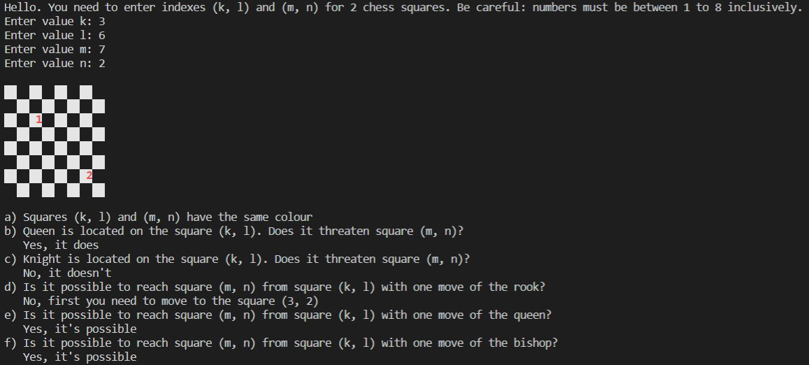

# Chess solver

## :mortar_board: About 
This is one more of my university assignments. The task was to write a program that could implement the algorithm for solving several chess problems. Here it is!

Input data is indexes of 2 chess squares that you want to use: (k, l) and (m, n). Be aware: ***values have to be integers from 1 to 8 inclusively***. On the output you wil get 6 questions about chess and answer for those problems. Also this program displays a picture of a chess board with marked chosen squares (number 1 for square (k, l) and number 2 for (m, n))

Here is a list of problems that this program solves:
- a) Do the squares have the same color?
- b) Queen is located on the square (k, l). Does it threaten square (m, n)?
- c) Knight is located on the square (k, l). Does it threaten square (m, n)?
- d) Is it possible to reach square (m, n) from square (k, l) with one move of the rook?
- e) Is it possible to reach square (m, n) from square (k, l) with one move of the queen?
- f) Is it possible to reach square (m, n) from square (k, l) with one move of the queen?



## :computer: Starting
The program is written in pure Python and works in console, so you only need to clone the repository and start the project.

Requirements are:
- Python >= 3.6
- Git

Please follow these instructions:
```bash
# clone the repository
$ git clone https://github.com/trynke/chess.git
# start the project
$ python chess.py
# the program works in console
```
